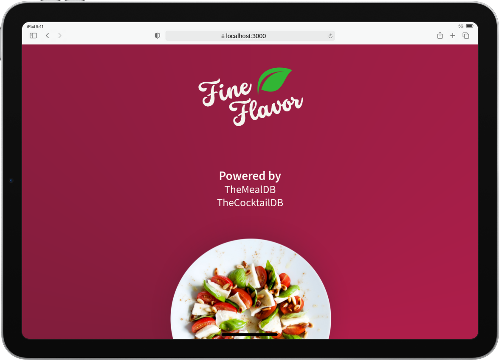
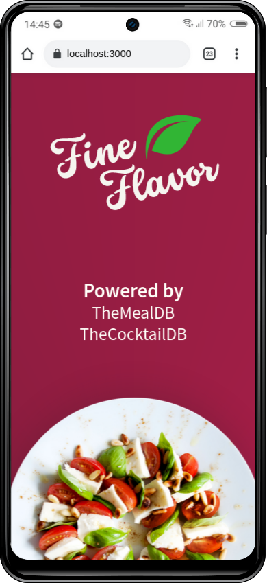
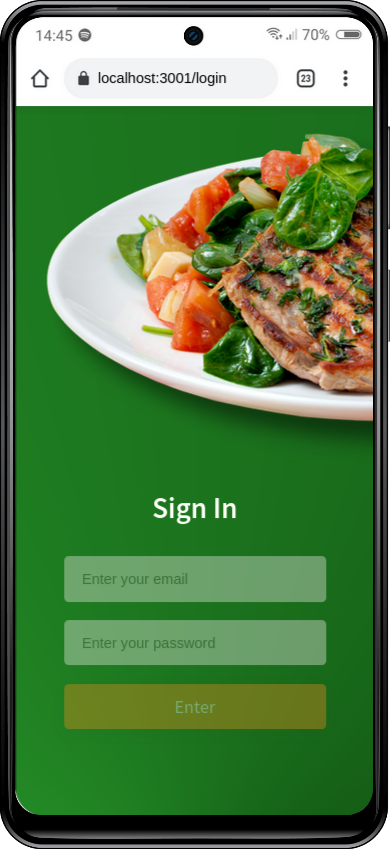
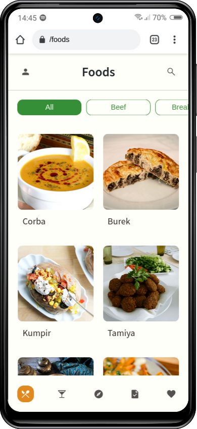
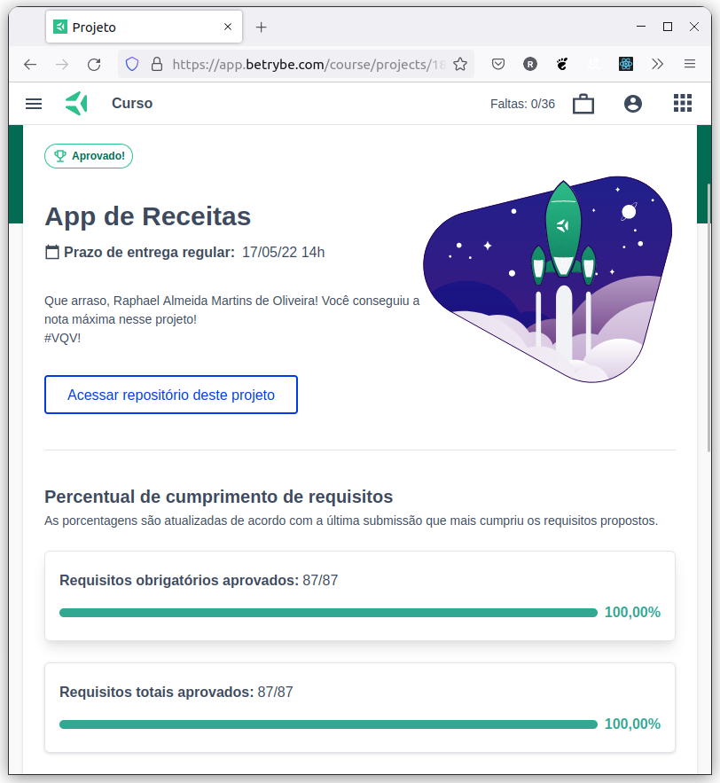

# :wine_glass: Fine Flavor (Recipes App) :stew:

## :page_with_curl: About/Sobre

  
<strong>:us: English</strong>
 

React group project developed by [Raphael Martins](https://www.linkedin.com/in/raphaelameidamartins/), [Danielly Olimpo](https://github.com/daniolimpiof), [Leonardo Dantas](https://github.com/LDantasA) and Gabriel Harmel at the end of Unit 18 ([Front-end Development Module](https://github.com/raphaelalmeidamartins/trybe_exercicios/tree/main/2_Desenvolvimento-Front-end)) of Trybe's Web Development course. We were approved with 100% of the mandatory and optional requirements met.

We had to develop a Recipes mobile App with React fetching for products data from two public APIs. We also had to use agile methologies such as Scrum and Kanban.

### Note

This project is current under development. I am refactoring all the tests and still have to finish the CSS. I haven't deployed the application yet.

<!-- [Click here]() to check out the final version of the project on your browser. -->
 

  
<strong>:brazil: Português</strong>
 

Projeto React em grupo desenvolvido por [Raphael Martins](https://www.linkedin.com/in/raphaelameidamartins/), [Danielly Olimpo](https://github.com/daniolimpiof), [Leonardo Dantas](https://github.com/LDantasA) and Gabriel Harmel ao final do Bloco 18 ([Módulo Desenvolvimento Front-end](https://github.com/raphaelalmeidamartins/trybe_exercicios/tree/main/2_Desenvolvimento-Front-end)) do curso de Desenvolvimento Web da Trybe. Fui aprovado com 100% dos requisitos obrigatórios e opcionais atingidos.

Tivemos que desenvolver um aplicativo de receitas mobila com React consumindo dados de duas APIs públicas. Também tivemos que utilizar metodologias de desenvolvimento ágil como Scrum e Kanban.

### Observação

Este projeto está em desenvolvimento. Estou refatorando todos os testes e ainda preciso finalizar o CSS. Não fiz o deploy da aplicação ainda.

<!-- [Clique aqui]() para conferir a versão final do projeto no seu navegador. -->
 

## :man_technologist: Developed Skills/Habilidades Desenvolvidas

  
<strong>:us: English</strong>
 

* Work in group using agile development methodologies
* Develop a React application using React Router
* Fetch data from a public API
* Implement tests with RTL (React Testing Library)
* Use Redux or React Context API for state management
 

  
<strong>:brazil: Português</strong>
 

* Trabalhar em grupo usando metodologias de desenvolvimento ágil
* Desenvolver uma aplicação React usando React Router
* Consumir dados de uma API pública
* Implementar testes com RTL (React Testing Library)
* Gerenciar o estado da aplicação com Redux ou Context API
 

## :memo: Methodologies/Metodologias

* Mobile First
* Kanban
* Scrum

## :hammer_and_wrench: Tools/Ferramentas

* HTML5
* CSS3
* Sass
* JavaScript ES6+
* React.js
* RTL (React Testing Library)
* Redux
* Google Fonts Icon Library
* GitHub Pages

## :iphone: Mobile version/Versão mobile

## :trophy: Grade/Nota

### :copyright: Copyright disclaimer/Aviso de direitos autorais

  
<strong>:us: English</strong>
 

We developed this project for learning purposes, all the code and documentation texts are our authorship, and the rights belong exclusively to us. It is allowed to download or clone the repository for study purposes. However, it is not allowed to publish full or partial copies. This disclaimer does not cover libraries and dependencies, which are subject to their respective licenses.

We use [TheMealDB](https://www.themealdb.com/api.php) and [TheCocktailDB](https://www.thecocktaildb.com/api.php) APIs to fetch the recipes' data.
 

  
<strong>:brazil: Português</strong>
 

Desenvolvemos esse projeto para propósitos de aprendizagem, todo o código e documentação são de nossa autoria e os direitos pertencem exclusivamente a nós. É permitido baixar ou clonar o repositório para fins de estudo. Contudo, não é permitido publicar cópias totais ou parciais. Este aviso não cobre bibliotecas e dependências, estas estão sujeitas a suas respectivas licenças.

Usamos as APIs [TheMealDB](https://www.themealdb.com/api.php) e [TheCocktailDB](https://www.thecocktaildb.com/api.php) para consumir dados de receitas.
 

